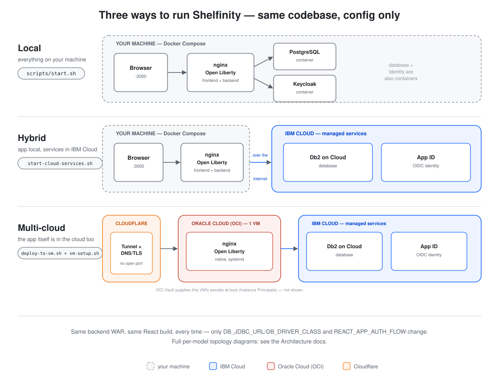

# Shelfinity - Library Management System

[](https://github.com/Amalraj-Joseph/Shelfinity/actions/workflows/ci.yml)

A modern, multi-cloud library management system — Jakarta EE 10 and React 18, running the exact same codebase as a local Docker stack or as a free-tier deployment spanning IBM Cloud, Oracle Cloud Infrastructure, and Cloudflare (see [Deployment models](#deployment-models) below).

🚀 **[Live demo](https://shelfinity-app.amalraj.dev)** — the multi-cloud deployment described below, running for real.

📖 **[Documentation](https://shelfinity.amalraj.dev)** — getting started, architecture, business rules, and the full API reference.

### Built with


## Quick start

```bash
git clone git@github.com:Amalraj-Joseph/Shelfinity.git
cd Shelfinity
./scripts/start.sh
```

This builds and starts Postgres, Keycloak, the backend, and the frontend, and waits for the backend to report healthy. Then open **http://localhost:3000**.

| Username | Password | Role |
|---|---|---|
| `admin` | `admin123` | Admin |
| `john.doe` | `john123` | User |

> Change these credentials before deploying anywhere beyond local development.

To stop everything: `./scripts/stop.sh` (add `-v` to also drop the database volume).

See **[shelfinity.amalraj.dev](https://shelfinity.amalraj.dev)** for architecture, the exact business rules (registration approval, borrow/return, reservations), the full API reference, and the authoritative [`docs/api/SPEC.md`](docs/api/SPEC.md).

### Running locally against IBM Cloud services

To build and run the app locally the same way, but against real **Db2 on Cloud** and **App ID** instances instead of the local Postgres/Keycloak containers:

```bash
cp .env.cloud-services.example .env.cloud-services   # fill in your Db2/App ID values
./scripts/start-cloud-services.sh
```

The script refuses to start until every placeholder in `.env.cloud-services` (git-ignored — it holds real credentials) has been filled in. Stop with `./scripts/stop-cloud-services.sh`. This is separate from the full cloud deployment below — it keeps the app itself on your machine and only the database/identity calls leave it.

## Running the tests

```bash
cd backend && mvn clean verify              # unit tests + coverage gate
cd backend && mvn test -Prepository-it      # repository tests (Testcontainers)
cd frontend && npm test -- --watchAll=false # unit/component tests
cd frontend && npx playwright test          # end-to-end (stack must be running)
```

## Deployment models

Shelfinity runs the exact same backend WAR and React build in all three setups below — nothing but environment variables and build args changes between them:



| | Runs on | Database | Identity | Script |
|---|---|---|---|---|
| **Local** | your machine, Docker Compose | Postgres (container) | Keycloak (container) | `./scripts/start.sh` |
| **Hybrid** | your machine, Docker Compose | Db2 on Cloud | App ID | `./scripts/start-cloud-services.sh` |
| **Multi-cloud** | one OCI VM, systemd | Db2 on Cloud | App ID | `deploy/deploy-to-vm.sh` + `deploy/vm-setup.sh` |

Swapping between them is entirely config-driven: `DB_JDBC_URL`/`DB_DRIVER_CLASS` select Postgres vs. Db2, `REACT_APP_AUTH_FLOW` selects Keycloak's ROPC flow vs. App ID's PKCE flow, and `.env.example`/`.env.cloud-services.example` document every variable.

The **multi-cloud** model additionally spans three providers end to end — Cloudflare at the edge (DNS, TLS, tunnel), Oracle Cloud Infrastructure running the VM itself (plus Vault for secrets), and IBM Cloud's Db2/App ID behind it. For the full topology diagram of each model and the technology rationale behind them, see the **[Architecture docs](https://shelfinity.amalraj.dev/architecture/#deployment-models)**.

### Why no Docker on the VM?

The multi-cloud model's free-tier OCI VM has just 1GB of RAM — not enough headroom for a persistent Docker daemon (`dockerd` + `containerd` + a shim per container) on top of what a JVM app server already needs. So on that one path, `nginx` and Open Liberty run natively under systemd instead of in containers. Local and Hybrid, which run on your own machine rather than a memory-capped free-tier VM, still use Docker Compose unchanged, for a fast and easy development experience.

## License

MIT — see [LICENSE.txt](LICENSE.txt).

---

### Thanks

Shelfinity's cloud deployment runs entirely on generous free tiers. Thank you to:

- **[Oracle Cloud Infrastructure](https://www.oracle.com/cloud/free/)** for the Always Free compute instance this app runs on and its Vault service
- **[IBM Cloud](https://www.ibm.com/cloud/free)** for the Lite Db2 and App ID plans backing its data and identity
- **[Cloudflare](https://www.cloudflare.com/plans/free/)** for the free Tunnel and DNS/TLS that put it on the internet safely

Without any of the three, this project's cloud deployment wouldn't exist.

Thanks also to **[Claude](https://claude.com)** (Anthropic) and **[ChatGPT](https://chatgpt.com)** (OpenAI), used throughout this project's development for planning, coding, debugging, and review.
